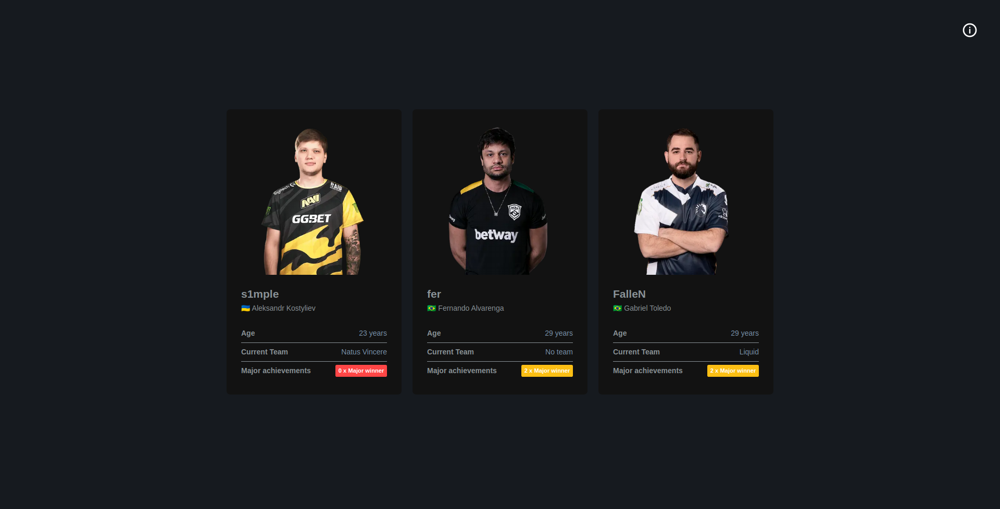

<p align="center">
  <a href="#rocket-tecnologias">Tecnologias</a>&nbsp;&nbsp;&nbsp;|&nbsp;&nbsp;&nbsp;
  <a href="#information_source-como-usar">Como usar</a>&nbsp;&nbsp;&nbsp;|&nbsp;&nbsp;&nbsp;
  <a href="#memo-licença">Licença</a>
</p>

<p align="center">
  
</p>

## :rocket: Tecnologias

Esse projeto foi desenvolvido com as seguintes tecnologias:

-  [NextJS](https://nextjs.org/)
-  [Typescript](https://www.typescriptlang.org/)
-  [Graphql](https://graphql.org/)
-  [GraphCMS](https://graphcms.com/)
-  [NextPWA](https://github.com/shadowwalker/next-pwa)
-  [Jest](https://jestjs.io/)
-  [@lukemorales/eslint-config](https://www.npmjs.com/package/@lukemorales/eslint-config)
-  [husky](https://typicode.github.io/husky/#/)
-  [commitlint](https://github.com/conventional-changelog/commitlint)
-  [lint-staged](https://github.com/okonet/lint-staged)
-  [prettier](https://prettier.io/)
-  [styled-components](https://styled-components.com/)
-  [styled-icons](https://styled-icons.js.org/)
-  [styled-media-query](https://github.com/morajabi/styled-media-query)

## :information_source: Como usar

Para clonar e executar essa aplicação, você precisará do [Git](https://git-scm.com), [Node.js v10.16][nodejs] ou superior + [Yarn v1.13][yarn] ou superior instalado no sua máquina. Execute na linha de comando:

```bash
# Clone esse repositório
$ git clone https://github.com/MarcosRene/players-cs-global

# Vá para a pasta do respositório
$ cd players-cs-global

# Instale as dependências
$ yarn

# Execute o app
$ yarn dev
```

## :memo: Licença
Este projeto está sobre licença MIT. Consulte [LICENSE](https://github.com/MarcosRene/players-cs-global/blob/master/LICENSE) para mais informações.


[nodejs]: https://nodejs.org/
[yarn]: https://yarnpkg.com/
